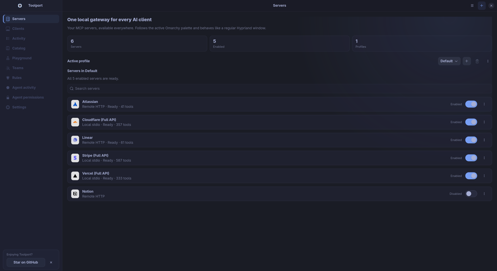

# Toolport

**Set up your MCP servers once. Use them in every AI client.**

Toolport is a local gateway for MCP, the protocol that gives AI apps access to
tools like GitHub, Slack, and databases. Connect your servers once, then share
them across Claude, Cursor, Codex, VS Code, and other clients.

[Download](https://toolport.app/download) · [Website & demo](https://toolport.app) · [Discord](https://discord.gg/Xsn27MxdBA)



## Why Toolport?

- **Less context overhead.** Agents search for tools when they need them instead
  of loading every tool definition up front. See the [benchmarks](BENCHMARK.md).
- **One setup for every client.** Add and authenticate each server once. Use
  profiles to choose which servers each client can access.
- **Keys stay local.** Credentials live in your OS keychain, outside client configs.
- **Control over tool calls.** Disable tools, require approval for destructive
  calls, and review activity in one place.
- **Shared agent rules.** Write instructions once and apply them to supported
  clients, with a preview before changes are written.

## Get started

1. [Download Toolport](https://toolport.app/download) for Windows, macOS, or Linux.
2. Add a server from the catalog, import an existing setup, or paste a server config.
3. Authenticate the server, then open **Clients** and connect your AI apps.

Installers and release notes are also on
[GitHub Releases](https://github.com/btsouth/toolport/releases).
For Linux desktop integration, see [Toolport on Omarchy](https://toolport.app/omarchy).

## Documentation

- [Supported clients and setup](docs/clients.md)
- [Profiles, environment variables, and configuration](docs/configuration.md)
- [Agent rules](docs/agent-rules.md) and [permissions](docs/agent-permissions.md)
- [Headless gateway and Docker](docs/headless.md)
- [Open WebUI](docs/openwebui.md) and [agent plugin](packaging/agent-plugin/toolport/README.md)
- [Security](SECURITY.md) and [troubleshooting](docs/troubleshooting.md)
- [Changelog](CHANGELOG.md)

## Development

Requires Node.js and stable Rust, plus the platform dependencies described in
[Contributing](CONTRIBUTING.md).

```sh
npm ci
npm run build:gateway
npm run tauri dev
```

See [Contributing](CONTRIBUTING.md) for testing and build instructions.

## Toolport Teams

Share server configuration and policies across a team while each member keeps
their own credentials. [Hosted and self-hosted options](https://toolport.app/teams).

## License

The desktop app and gateway are [MIT licensed](LICENSE).
